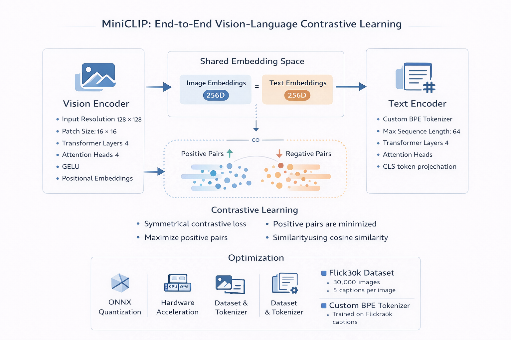
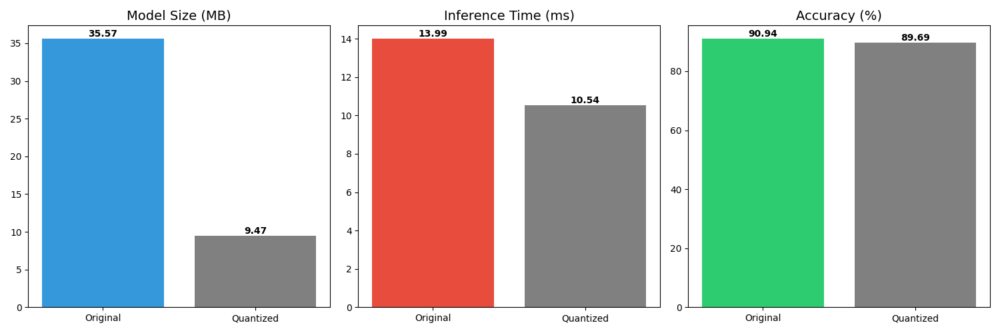
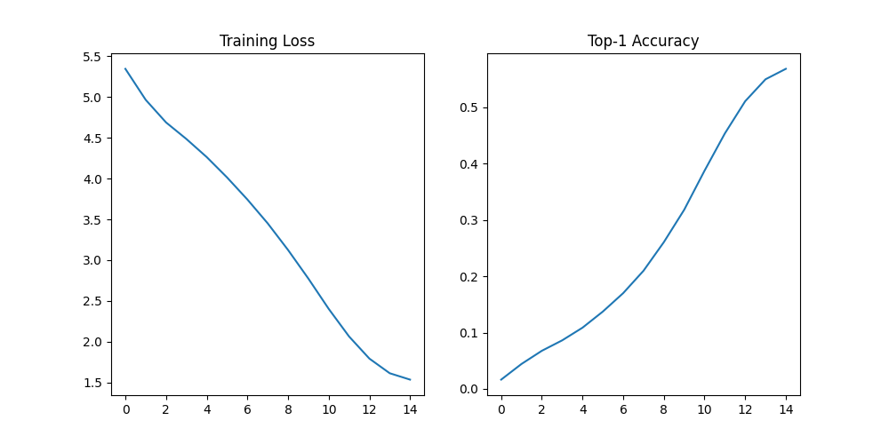
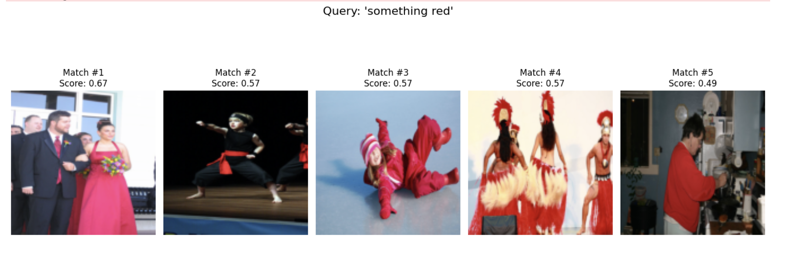
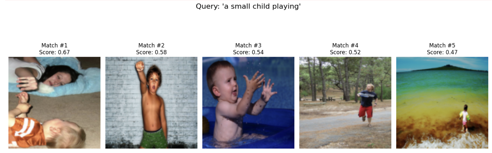
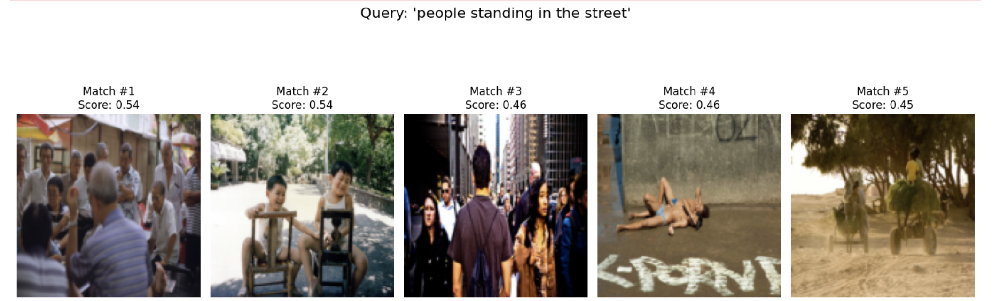
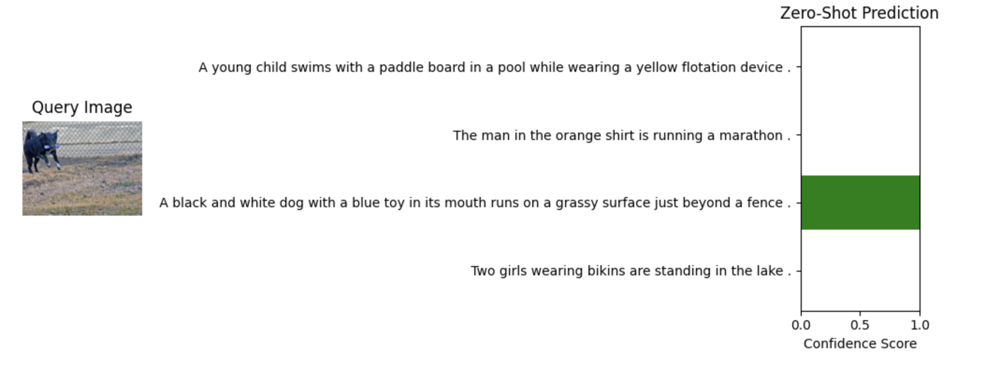
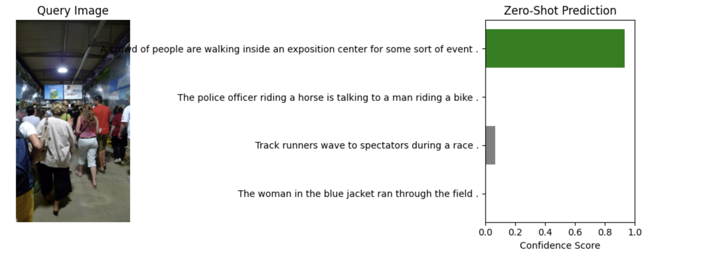
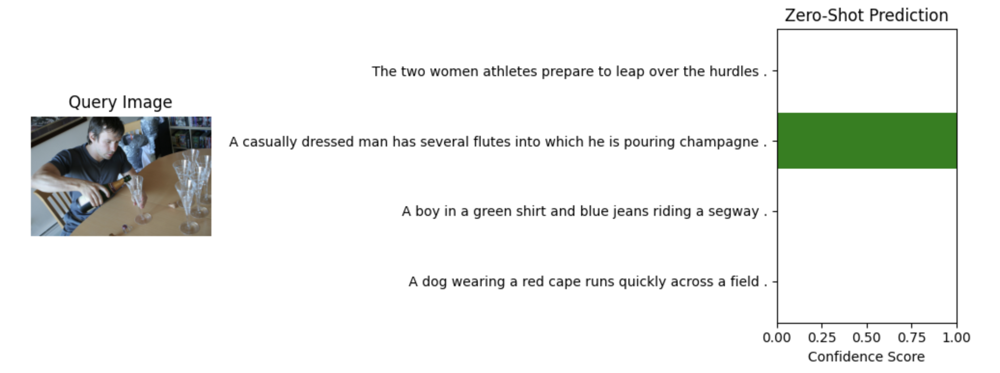

<p align="center">
  
  
  
  
  
  
</p>

<h1 align="center">NANOCLIP: Vision-Language Contrastive Learning</h1>

MiniCLIP is a complete, from-scratch implementation of the CLIP (Contrastive Language–Image Pre-training) architecture using PyTorch. This project focuses on building a lightweight, efficient, and deployable vision-language model capable of zero-shot image classification and semantic retrieval.

Unlike traditional image captioning systems, MiniCLIP learns a shared embedding space for both images and text. This enables semantic matching and classification of previously unseen categories using vector similarity.

---

<h2 align="center">Project Objectives</h2>

The primary goal of this project was to design and optimize a compact Vision-Language Model (VLM) suitable for edge and low-resource deployment while preserving the core principles of OpenAI’s CLIP architecture.

---

Key objectives include:

- Implementing a dual-encoder transformer architecture
- Training on real-world multimodal data
- Designing a custom tokenizer
- Optimizing inference using ONNX quantization
- Supporting hardware acceleration (CPU, GPU, MPS)

---

<h2 align="center">Technical Overview</h2>

### Architecture

- Dual Encoder Design:
  - Vision Transformer (ViT)
  - Text Transformer
- Contrastive Learning with symmetric cross-entropy loss
- Shared embedding space of 256 dimensions

<p align="center">
  
</p>


### Dataset

- Flickr30k Dataset
- 30,000 images
- 5 captions per image

### Tokenization

- Custom Byte-Pair Encoding (BPE)
- Trained on Flickr30k captions
- Implemented using HuggingFace Tokenizers

### Optimization

- ONNX Dynamic Quantization
- Float32 → Int8 conversion
- Reduced memory footprint and latency

---

<h2 align="center">Performance and Optimization Results</h2>

Post-training optimization was performed using ONNX Runtime to improve deployment efficiency.

### Quantitative Metrics

| Metric                  | Original Model | Quantized Model |
|--------------------------|----------------|------------------|
| Model Size               | 35.57 MB       | 9.47 MB          |
| Inference Latency        | 13.99 ms       | 10.54 ms         |
| Top-1 Accuracy           | 90.94%         | 89.69%           |
| Size Reduction           | -              | ~73%             |

### ONNX Benchmark

<p align="center">
  
</p>

---

<h2 align="center">System Architecture</h2>

The system consists of two independent transformer encoders that project image and text inputs into a common latent space.

---

### 1. Vision Encoder

- Input Resolution: 128 × 128
- Patch Size: 16 × 16
- Transformer Layers: 4
- Attention Heads: 4
- Activation: GELU
- Positional Embeddings: Learnable

The Vision Transformer captures global spatial relationships without relying on convolutional layers.

---

### 2. Text Encoder

- Tokenizer: Custom BPE
- Max Sequence Length: 64
- Transformer Layers: 4
- Output: CLS token projection
- Embedding Dimension: 256

The encoder models semantic relationships between tokens using self-attention.

---

### 3. Training Objective

The model is trained using symmetric contrastive loss.

For each image-text pair in a batch:

- Positive pairs are maximized
- Negative pairs are minimized
- Similarity is measured using cosine similarity

This encourages strong alignment between corresponding image and text embeddings.

---

<h2 align="center">Training Progress</h2>

The model was trained for 30 epochs. Rapid convergence was observed within the first 10 epochs, followed by stable validation performance.

<p align="center">
  
</p>

---

<h2 align="center">Directory Structure</h2>

The repository follows a modular design, separating configuration, modeling, inference, and deployment components.

---

<h2 align="center">Installation</h2>

Install the required dependencies:

```bash
pip install torch torchvision matplotlib pillow tokenizers onnxruntime

```
---

<h2 align="center">Usage</h2>

- Running the Interactive Demo

- The `app.py` script provides an interactive terminal interface for testing MiniCLIP.

```bash
python app.py
```


### Inference Workflow
- 1. Drag and drop an image into the terminal
- 2. Enter three candidate captions
- 3. The model computes similarity scores
- 4. A confidence bar chart is displayed

The system automatically detects available hardware acceleration.

---

<h2 align="center">Sample Inference Results</h2>

Below are examples demonstrating zero-shot classification and semantic alignment.

### Query I


<p align="center">
  
</p>

### Query II

<p align="center">
  
</p>

### Query III
<p align="center">
  
</p>


<h3 align="center">Image Query Inputs</h3>

### Input Image I
<p align="center">
  
</p>

### Input Image II

<p align="center">
  
</p>


### Input Image III

<p align="center">
  
</p>

---

<h2 align="center">Model Artifacts</h2>
- **mini_vlm_best.pth**: Best PyTorch checkpoint
- **nano_clip_int8.onnx**: Quantized ONNX deployment model

These files enable both research and production deployment.

---

<h2 align="center">Future Work</h2>

## Planned improvements include:
- Larger pretraining datasets
- Multi-lingual text support
- Distillation for mobile deployment
- Web-based UI
- Real-time video inference
- Model pruning

    

